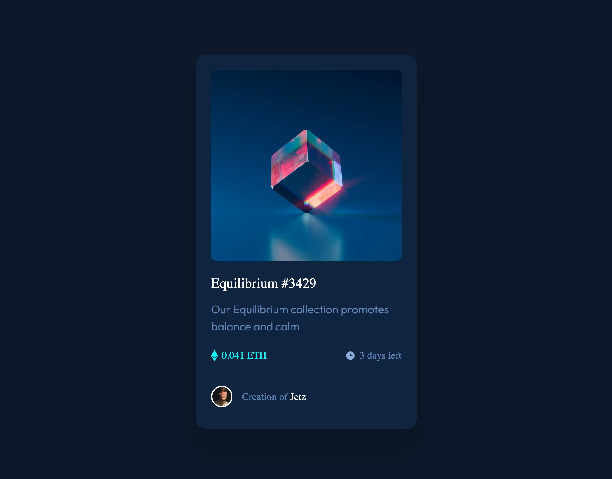

# Frontend Mentor - NFT preview card component solution

 Challenge [NFT preview card component challenge on Frontend Mentor](https://www.frontendmentor.io/challenges/nft-preview-card-component-SbdUL_w0U). 

This is my solution to the NFT preview card component challenge on Frontend Mentor  :D

 ### Screenshot

### Links

- [Solution Frontend Mentor](https://www.frontendmentor.io/solutions/nft-preview-card-using-css-zEOVlGs1B)

- [Live Site URL](https://jcjetz.github.io/FEM-NFT_preview_card/)

- [github](https://github.com/JCJetz/FEM-NFT_preview_card)

### The challenge

Users should be able to:

- View the optimal layout depending on their device's screen size
- See hover states for interactive elements

If you want some support on the challenge? [Join the Slack community](https://www.frontendmentor.io/slack) and ask questions in the **#help** channel.

### Useful resources
 
- ⭐ [Learn to code by playing games](https://flexboxfroggy.com/#es)

- ⭐ [How TO - Three Column Layout](https://www.w3schools.com/howto/howto_css_three_columns.asp)

- ⭐ [What is :hover::after?](https://stackoverflow.com/questions/70729611/what-is-hoverafter)

### Built with

- HTML
- CSS 
- Flexbox
